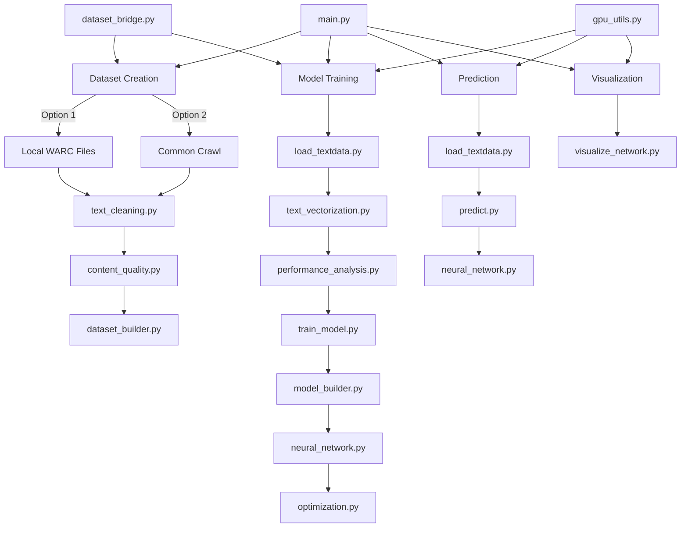

# NLP Neural Network Project

A comprehensive Natural Language Processing (NLP) project that implements text classification and sequence-to-sequence models with GPU acceleration. This project is optimized to run on a Windows environment with dual GPU setup (NVIDIA RTX4060 + GT1030).

## Features

- Multi-GPU support with intelligent resource allocation
- Text dataset creation and preprocessing
- Common Crawl integration for automated dataset generation
- Efficient text vectorization with parallel processing
- Neural network model training with both classification and sequence-to-sequence architectures
- Model prediction functionality
- Neural network visualization capabilities
- Integrated dataset quality analysis with automatic preprocessing
- Automatic mixed-precision (AMP) training for faster processing
- Lion optimizer implementation for improved convergence

## Dependencies

- Python 3.11.4+
- NumPy
- scikit-learn
- PyTorch (for GPU acceleration)
- CuPy (optional, for additional GPU support)
- warcio (for dataset creation)
- BeautifulSoup4 (for text extraction)
- matplotlib (for visualization)
- tqdm (for progress bars)
- requests (for Common Crawl access)

## Installation

1. Clone the repository:
```bash
git clone https://github.com/Ethan-LWT/NLP_project.git
cd NLP_project
```

2. Install dependencies:
```bash
pip install -r requirements.txt
```

## Usage

### Creating Text Datasets

The project supports creating datasets from either local WARC (Web ARChive) files or directly from Common Crawl:

#### From Local WARC Files:

```bash
python main.py --mode create_dataset --input_dir path/to/warc/files --output_dir path/to/output/directory --recursive --clean
```

Options:
- `--input_dir`: Directory containing WARC files
- `--output_dir`: Directory to save extracted text
- `--max_records`: Maximum number of records to process per file
- `--num_workers`: Number of worker processes (default: auto)
- `--file_batch_size`: Number of records to process in each batch
- `--sample`: Extract a random sample of N records
- `--recursive`: Recursively process WARC files in subdirectories
- `--file_pattern`: File pattern to match WARC files (default: *.warc)
- `--clean`: Clean the extracted text files
- `--clean_only`: Only clean existing text files, skip extraction
- `--deep_clean`: Perform more aggressive text cleaning
- `--force_process`: Process files even if output already exists

#### From Common Crawl:

```bash
python main.py --mode create_dataset --common_crawl --topics "artificial intelligence" "machine learning" --domains "wikipedia.org" --output_dir cc_dataset --clean
```

Common Crawl Options:
- `--common_crawl`: Generate dataset by querying and downloading from Common Crawl
- `--topics`: List of topics to filter content by (e.g., "machine learning" "python")
- `--domains`: List of domains to filter content by (e.g., "wikipedia.org" "example.com")
- `--limit_per_query`: Maximum results per query for Common Crawl (default: 50)
- `--crawl_index`: Common Crawl index to use (defaults to latest available)
- `--max_warcs`: Maximum number of WARC files to download from Common Crawl (default: 5)
- `--split_ratio`: Train/test split ratio for dataset (default: 0.8)
- `--list_crawls`: List available Common Crawl indexes and exit
- `--force_latest`: Force using the latest available index

### Training a Model with Integrated Quality Analysis

```bash
python main.py --mode train --model_type classifier --epochs 10 --training_data path/to/data.txt --analyze_quality --auto_clean --optimizer lion --use_amp
```

Options:
- `--model_type`: Type of model to train (classifier or seq2seq)
- `--epochs`: Number of epochs to train
- `--batch_size`: Batch size for training
- `--training_data`: Path to training data file
- `--testing_data`: Path to testing data file
- `--analyze_quality`: Analyze dataset quality before training
- `--auto_clean`: Automatically clean data if quality is poor
- `--quality_threshold`: Quality threshold for automatic cleaning (0.0-1.0)
- `--skip_quality_check`: Skip quality analysis and proceed directly to training
- `--optimizer`: Optimization algorithm to use (lion, adam, adamw, sgd) (default: lion)
- `--use_amp`: Enable automatic mixed-precision training for faster processing
- `--no_amp`: Disable automatic mixed-precision training (use if experiencing numerical issues)

The quality analysis integrates with the training process to:
1. Assess dataset quality using performance_analysis.py
2. Determine if preprocessing is needed based on quality metrics
3. Clean the data only when necessary
4. Verify that cleaning improved the quality
5. Use the original or cleaned data based on quality improvement

### Text Cleaning Utilities

The project includes robust text cleaning utilities that can be used independently or as part of the dataset creation pipeline:

```bash
# Clean a single text file
python text_cleaning.py input.txt --output cleaned.txt --deep

# Clean all text files in a directory
python text_cleaning.py ./data_dir --output ./clean_dir --batch --pattern "*.txt" --workers 4

# Analyze content quality of a text file
python content_quality.py input.txt --deep --language zh
```

Options:
- `--deep`: Apply more aggressive cleaning (removes noise, special characters, etc.)
- `--batch`: Process all files in a directory
- `--pattern`: File pattern to match when cleaning in batch mode (default: *.txt)
- `--workers`: Number of parallel workers for batch processing (default: CPU cores - 1)
- `--language`: Specify language for content quality analysis (auto-detect by default)

You can also use these cleaning functions programmatically:

```python
from text_cleaning import clean_text, batch_clean_files
from content_quality import ContentQualityAnalyzer, filter_low_quality_content

# Clean a single file
clean_text('input.txt', deep_clean=True, output_file='cleaned.txt')

# Clean all files in a directory
batch_clean_files('data_dir', deep_clean=True, output_dir='clean_dir')

# Analyze content quality
analyzer = ContentQualityAnalyzer()
metrics = analyzer.analyze_text(text, deep_analysis=True)
print(f"Quality score: {metrics['quality_score']}")

# Filter out low-quality content
high_quality_texts = filter_low_quality_content(text_list)
```

### Advanced Content Quality Analysis

The project now features an enhanced content quality analysis system that can:

1. Detect and filter out low-quality content like:
   - Test/exam questions and answers
   - Website boilerplate (navigation, footers, etc.)
   - Login/registration forms
   - Content with excessive HTML artifacts
   - Machine-generated or highly repetitive text

2. Perform language-specific cleaning for:
   - English
   - Chinese (中文)
   - Japanese (日本語)
   - Korean (한국어)
   - And more

3. Calculate quality scores based on various indicators:
   - Lexical diversity
   - Paragraph structure
   - Boilerplate density
   - HTML artifact presence
   - Content repetition

```bash
# Analyze content quality with full report
python content_quality.py large_dataset.txt --deep

# Filter and clean a directory of text files
python main.py --mode clean --input_dir raw_data --output_dir cleaned_data --analyze_quality --deep_clean
```

### Advanced Common Crawl Integration

The project provides direct access to Common Crawl datasets through a streamlined workflow:

```bash
# List all available Common Crawl indexes
python main.py --mode create_dataset --list_crawls

# Download content from Common Crawl with topic and domain filtering
python main.py --mode create_dataset --common_crawl \
               --topics "artificial intelligence" "python" \
               --domains "wikipedia.org" \
               --output_dir ai_dataset
```

The Common Crawl integration:
1. Automatically uses the newest available dataset index by default
2. Downloads WARC files based on specified topics and domains
3. Filters content during extraction to focus on relevant material
4. Performs optional cleaning and text normalization
5. Creates both training and testing datasets with configurable splitting ratios

### One-Command Dataset Creation and Training

For the ultimate convenience, you can create a dataset from Common Crawl and immediately train a model on it with a single command:

```bash
python main.py --mode train --create_and_train \
               --topics "machine learning" "deep learning" \
               --domains "arxiv.org" "wikipedia.org" \
               --model_type classifier --epochs 15 \
               --analyze_quality --auto_clean
```

This unified workflow:
1. Automatically fetches the latest Common Crawl data
2. Downloads and processes WARC files matching your topics/domains
3. Creates a dataset with automatic train/test splitting
4. Analyzes the dataset quality and performs intelligent cleaning if needed
5. Trains a model using the prepared dataset
6. Saves the trained model and associated files

Options specific to this workflow:
- `--create_and_train`: Enables the combined dataset creation and training workflow
- `--force_latest`: Always use the latest Common Crawl index regardless of other settings

## Project Structure

- `main.py`: The main entry point for all operations with integrated quality analysis
- `text_vectorization.py`: Handles text vectorization with GPU acceleration
- `neural_network.py`: Neural network model implementations
- `optimization.py`: Optimization algorithms including Lion and AMP utilities
- `train_model.py`: Model training logic
- `predict.py`: Prediction functionality
- `visualize_network.py`: Neural network visualization
- `load_textdata.py`: Functions for loading and processing text data
- `text_cleaning.py`: Text cleaning utilities
- `content_quality.py`: Content quality analysis and filtering
- `dataset_bridge.py`: Bridge between dataset formats
- `dataset_builder.py`: Utilities for building datasets
- `gpu_utils.py`: Utilities for GPU benchmarking and hardware optimization
- `model_builder.py`: Factory methods for creating different neural network architectures
- `performance_analysis.py`: Tools for analyzing text processing performance integrated with the main workflow

## Performance Optimization

This project is optimized to efficiently use both CPU and GPU resources:

1. **GPU Management**: Automatically detects and prioritizes the RTX4060 for more intensive tasks while utilizing the GT1030 for lighter processing.
2. **Parallel Processing**: Uses multi-threading and multi-processing to fully utilize CPU resources.
3. **Batch Processing**: Implements batching to optimize memory usage and GPU efficiency.
4. **Memory Optimization**: Dynamic memory management to prevent out-of-memory errors.
5. **Smart Preprocessing**: Analyzes dataset quality to avoid unnecessary preprocessing.
6. **Automatic Mixed Precision (AMP)**: Uses lower precision (FP16) calculations where appropriate to speed up training while maintaining accuracy.
7. **Lion Optimizer**: Implements the Lion optimization algorithm from Google Research for faster convergence with less memory usage.

## Advanced Training Options

### Automatic Mixed Precision (AMP)

AMP is automatically enabled for compatible GPUs (RTX series, Volta, Ampere, etc.) and significantly speeds up training:

```bash
# Enable AMP (default)
python main.py --mode train --model_type classifier --training_data data.txt --use_amp

# Disable AMP if numerical stability issues are encountered
python main.py --mode train --model_type classifier --training_data data.txt --no_amp
```

### Optimizer Selection

The project supports multiple optimizers with Lion being the default:

```bash
# Use Lion optimizer (default)
python main.py --mode train --model_type classifier --training_data data.txt --optimizer lion

# Use Adam optimizer
python main.py --mode train --model_type classifier --training_data data.txt --optimizer adam

# Use AdamW optimizer
python main.py --mode train --model_type classifier --training_data data.txt --optimizer adamw

# Use SGD optimizer
python main.py --mode train --model_type classifier --training_data data.txt --optimizer sgd
```

## Examples

### Complete Pipeline Example with Common Crawl

```bash
# 1. Create a dataset directly from Common Crawl
python main.py --mode create_dataset --common_crawl \
               --topics "artificial intelligence" "machine learning" "natural language processing" \
               --domains "wikipedia.org" "arxiv.org" \
               --output_dir cc_dataset --clean --max_warcs 10

# 2. Train a model with automatic quality analysis, cleaning, and optimization
python main.py --mode train --model_type classifier --epochs 20 --batch_size 64 \
               --training_data cc_dataset/train.txt --testing_data cc_dataset/test.txt \
               --analyze_quality --auto_clean --quality_threshold 0.7 \
               --optimizer lion --use_amp --save_model models

# 3. Make predictions
python main.py --mode predict --text "This is a sample text for classification" --output_path models

# 4. Create a visualization
python main.py --mode visualize --text "Natural language processing is fascinating" --output_path models --vis_quality high_quality
```

### Complete End-to-End Pipeline in a Single Command

The project supports running the entire pipeline from dataset creation to model training in a single command:

```bash
python main.py --mode train --create_and_train \
               --topics "artificial intelligence" "natural language processing" \
               --domains "wikipedia.org" "arxiv.org" \
               --model_type classifier --epochs 20 --batch_size 64 \
               --analyze_quality --auto_clean --quality_threshold 0.7 \
               --optimizer lion --use_amp
```

This single command will:
1. Automatically download data from Common Crawl based on specified topics and domains
2. Process and clean the downloaded data
3. Analyze the dataset quality
4. Perform additional cleaning if quality is below threshold
5. Train a model on the prepared dataset
6. Save the trained model and associated files

Options:
- `--create_and_train`: Enable the combined workflow
- `--topics`: List of topics to search for in Common Crawl
- `--domains`: Specific domains to target in Common Crawl
- `--force_latest`: Always use the latest Common Crawl index
- All standard training options are also supported

### Working with Different Common Crawl Datasets

```bash
# List available Common Crawl indexes
python main.py --mode create_dataset --list_crawls

# Use a specific crawl index
python main.py --mode create_dataset --common_crawl \
               --crawl_index CC-MAIN-2023-14 \
               --topics "climate change" --output_dir climate_data

# Force using the latest index regardless of other settings
python main.py --mode create_dataset --common_crawl \
               --topics "quantum computing" --force_latest \
               --output_dir quantum_data
```

### Creating Datasets in Different Languages

The project supports creating datasets in multiple languages:

```bash
# Create a dataset with Chinese content
python main.py --mode create_dataset --common_crawl \
               --topics "人工智能" "机器学习" \
               --domains "zhihu.com" "baidu.com" \
               --output_dir chinese_dataset

# Create a dataset with multilingual content
python main.py --mode create_dataset --common_crawl \
               --topics "climate change" "cambio climático" "气候变化" \
               --output_dir multilingual_dataset
```

## Complete Workflow

The complete workflow of this NLP project is illustrated in the diagram below, showing how the various components interact:



### Workflow Explanation

1. **Dataset Creation**
   - Starts with either local WARC files or Common Crawl data acquisition
   - Processes through text cleaning and content quality analysis
   - Builds structured datasets ready for model training

2. **Model Training**
   - Loads text data and performs vectorization
   - Analyzes dataset performance and quality
   - Trains the selected model type (classifier or seq2seq)
   - Uses the appropriate neural network architecture
   - Applies optimization techniques (Lion optimizer, AMP)

3. **Prediction**
   - Loads the trained model
   - Processes input text through the same vectorization pipeline
   - Generates predictions using the trained model

4. **Visualization**
   - Creates visual representations of the neural network
   - Visualizes training progress and model architecture

### Combined Workflow

The project supports an end-to-end workflow that combines these components:

1. **Data Acquisition** → Common Crawl or local WARC files
2. **Data Processing** → Text extraction, cleaning, quality analysis
3. **Dataset Creation** → Building structured training/testing datasets
4. **Quality Analysis** → Analyzing and improving dataset quality
5. **Model Training** → Vectorization, training with GPU acceleration
6. **Model Evaluation** → Testing performance on held-out data
7. **Model Deployment** → Saving models for later use in prediction
8. **Prediction** → Using trained models to classify new text or generate sequences

This unified workflow can be executed with a single command using the `--create_and_train` option, which handles everything from data acquisition to model training automatically.

## Contributing

Contributions are welcome! Please feel free to submit a Pull Request.

## License

This project is licensed under the MIT License - see the LICENSE file for details.
